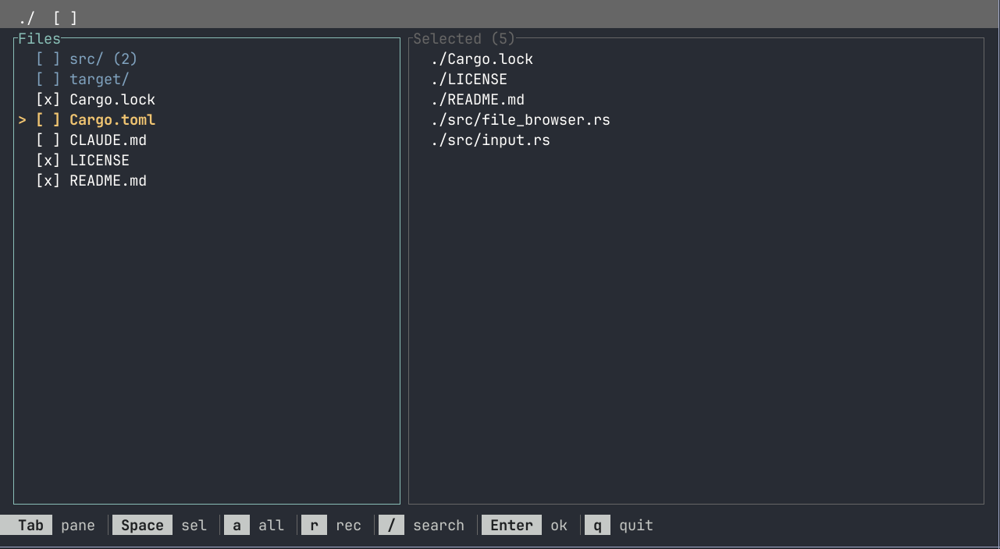

# file-list

A TUI file selector with vim-style navigation for selecting multiple files and directories.



## Features

- Vim-style navigation (hjkl) and arrow keys
- Select files and directories across multiple directories
- Recursive selection for directories
- Pre-select files via stdin or CLI arguments
- Edit a selections file with `-f` (with quick save via `s`)
- Search files in current directory with `/`
- Show/hide hidden files
- Scrollable file lists with smart cursor positioning
- Invalid paths displayed in red (for non-existent pre-selected files)

## Installation

```bash
cargo install --path .
```

Or build from source:

```bash
cargo build --release
./target/release/file-list
```

## Usage

```bash
file-list [OPTIONS] [FILES...]
```

### Options

| Option | Description |
|--------|-------------|
| `-a, --absolute` | Output absolute paths |
| `-r, --relative` | Output relative paths (default) |
| `-H, --hidden` | Show hidden files by default |
| `-f, --file <FILE>` | Read/write selections from file |

### Examples

```bash
# Basic file selection
file-list

# Pre-select files
file-list src/main.rs Cargo.toml

# Pipe pre-selections
find . -name "*.rs" | file-list

# Edit a selections file
file-list -f my-selections.txt

# Show hidden files, output absolute paths
file-list -H -a
```

## Key Bindings

| Key | Action |
|-----|--------|
| `j` / `Down` | Move cursor down |
| `k` / `Up` | Move cursor up |
| `h` / `Left` | Go to parent directory |
| `l` / `Right` | Enter directory |
| `Space` | Toggle selection / Deselect in Selected pane |
| `a` | Select/deselect all in current directory |
| `r` | Recursively select/deselect directory contents |
| `/` | Search files in current directory |
| `s` | Save to file (only with `-f` option) |
| `Tab` | Switch between Files and Selected panes |
| `.` | Toggle hidden files |
| `Enter` | Confirm and output selections |
| `q` / `Esc` | Quit without output |

### Search Mode

When you press `/`, the status bar becomes a search input:
- Type to search - cursor jumps to first matching file/directory
- `Enter` - confirm and exit search mode
- `Esc` - cancel search

## UI Layout

```
┌────────────────────────────────────────────────────────────┐
│ ./current/directory                                   [H]  │
├──────────────────────┬─────────────────────────────────────┤
│ Files                │ Selected (3)                        │
│ > [x] src/           │ > ./src/main.rs                     │
│   [ ] tests/         │   ./Cargo.toml                      │
│   [x] Cargo.toml     │   ./README.md                       │
│   [ ] README.md      │                                     │
└──────────────────────┴─────────────────────────────────────┘
│ Tab pane│Space sel│a all│r rec│/ search│Enter ok│q quit   │
└────────────────────────────────────────────────────────────┘
```

- Focused pane has a cyan border
- Directories show count of selected files inside: `src/ (5)`
- Invalid/non-existent paths are shown in red
- File lists scroll automatically to keep cursor visible
- When using `-f`, the legend shows `s save` for quick saving

## License

MIT
